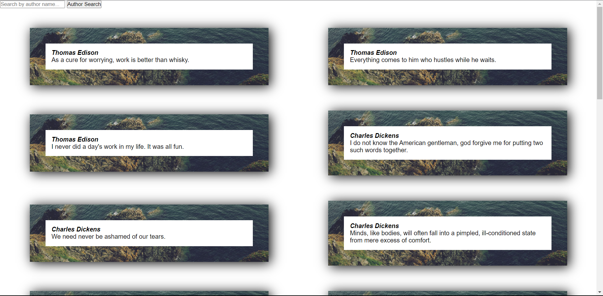

### JS Challenge 7




## Step 1:

Inside the `script.js` file, add needed code to add html elements using the following structure:

```html
<div class="container">
  <div class="login__container">
    <div class="login__signin">
      <div class="login__signin-now">
        <h1>Sign up NOW!</h1>
        <h3>Enter your details</h3>
        <form>
          <label>
            Email
            <input
              class="input-field"
              type="email"
              placeholder="Email"
              required
            />
          </label>
          <label>
            Password
            <input
              class="input-field"
              type="password"
              placeholder="Password"
              required
            />
          </label>
          <label>
            Confirm Password
            <input
              class="input-field"
              type="cPassword"
              placeholder="Confirm Password"
              required
            />
          </label>
          <button class="filled-btn" id="submit-btn">Submit</button>
        </form>
      </div>
    </div>
  </div>
</div>
```

## Step 1.1:

Add the needed JS code to check if the password and confirm password inupts are the same. (You need to check on every click for the submit button).
If the passwords are not the same, show an error message under the confirm password input.
Else, redirect to the quotes page(quote.html).

## Step 2:

Inside the `quote.js` file, add needed code to add html elements using the following structure:

```html
<blockquote>
  "I think that beauty can injure you to death. It can cause an injury that can
  never be cured. Or it can so traumatise you, your life changes direction. The
  beauty of the harmony of nature that is forever lost, or a daily rite that you
  perform, or diving into the sea for a swim. Those experiences are going to
  mark you."
  <div class="author">
    &mdash;
    <cite> Toni Servillo </cite>
  </div>
</blockquote>
```

## Step 3:

Do the needed modifications to `Step 2`, where you need to loop over the array of quotes and add them to the page.

## Step 4:

Add filter functionality to the page, where you can filter the quotes by the author name.

Note: Make sure to check style.css for the needed styles.

Don't forget to push your code to GitHub!<br>
Wishing you all the best and happy coding!<br>
In case you have any questions, feel free to google it.<br>
Remember to continually commit your Challenge 7 - Done with step to your completion of the various steps. Good luck with the challenge!
